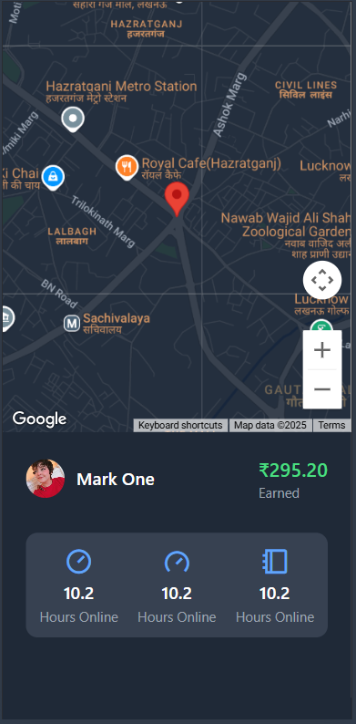

# RideSimple Frontend

## Getting Started

To run the frontend:
1. Open a terminal in `RideSimple/frontend`
2. Run: npm install
3. Run: npm run dev
4. Open your browser at the displayed localhost URL

## Pages Overview

### User-facing Pages
- **Start.jsx**: Landing page that introduces users to RideSimple and directs them to login/signup.
- **Login.jsx & Signup.jsx**: Authentication interfaces for users with form validation.
- **Home.jsx**: User dashboard featuring:
  - Location search with autocomplete
  - Fare calculation based on distance
  - Ride options selection
  - Payment method selection
  - Ride confirmation panel
- **Riding.jsx**: Active ride interface showing:
  - Live tracking map
  - Driver details and vehicle information
  - OTP verification
  - Pickup and destination details
  - Fare information
  - Payment processing with redirect

### Captain-facing Pages
- **CaptainLogin.jsx & CaptainSignup.jsx**: Authentication for drivers with vehicle registration.
- **CaptainHome.jsx**: Driver dashboard showing:
  - Availability toggle
  - Nearby ride requests
  - Earnings overview
  - Heat map for high-demand areas
- **CaptainRiding.jsx**: Interface for active rides showing:
  - Live tracking
  - Navigation directions
  - Passenger details
  - Ride completion options

## Core Components
- **LiveTracking.jsx**: Real-time map component using Mapbox integration.
- **LocationSearch.jsx**: Geocoding and location search component.

## Project Screenshots

### User Interface
<!-- Add screenshots here -->

### Captain Interface
<!-- Add screenshots here -->

## Technology Stack
- React.js with Hooks and Context API
- Socket.IO for real-time communication
- Mapbox for mapping and navigation
- Tailwind CSS for styling
- Axios for API requests
- React Router for navigation
